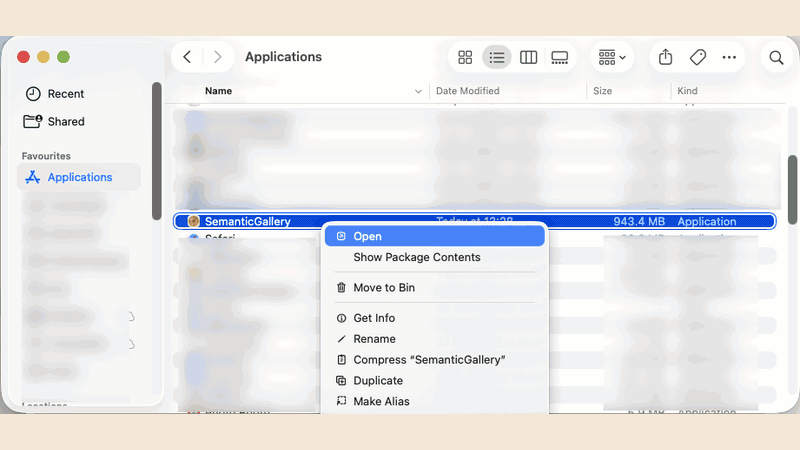

# SemanticGallery

SemanticGallery is a local-first semantic image search app for Apple Silicon. You pick a folder of images, the native macOS app indexes that folder locally, and you search it from one window.

- Private images stay on disk. The gallery itself is not uploaded.
- Semantic search works across photos and screenshots.
- On first use, SemanticGallery prepares its local runtime, indexes the selected folder, and can adapt to your library from `Settings`.
- The workspace supports text search, image search, similar-image search, preview, metadata inspection, batch selection, and delete.
- The current desktop release is written in Swift and runs on MLX for Apple Silicon.

## Requirements

- Apple Silicon
- macOS 15.0 or later
- Supported formats: `.jpg`, `.jpeg`, `.png`, `.bmp`, `.tiff`, `.heic`, `.heif`

## Install

1. Download the latest `dmg` from [GitHub Releases](https://github.com/yongyaoduan/SemanticGallery/releases/latest).
2. Open the disk image and drag `SemanticGallery.app` into `Applications`.
3. For the first launch, open Finder, locate `SemanticGallery.app`, right-click it, then choose `Open`.
4. If Gatekeeper still blocks the app, open `System Settings` -> `Privacy & Security`, scroll down to the `Security` section, click `Open Anyway`, then confirm `Open Anyway` in the dialog.
5. This extra step is usually only needed the first time. After the first successful launch, you can open the app normally.

The release already bundles the SigLIP2 base files, the published stage-1 checkpoint, and the public adaptation anchor. First launch mainly prepares the local database and app folders.

## First Use

- Launch the app. If bundled artifacts are already available, SemanticGallery opens directly into the workspace.
- Open `Settings`, choose a library folder, and let the app start indexing.
- While indexing runs, the status card shows the busy indicator, percentage, elapsed time, and remaining time.
- Return to the workspace and search with text, or paste an image into the search field.
- Click a result to open the large preview. From there you can run similar-image search, inspect metadata, delete, or close the preview.
- Private adaptation also lives in `Settings`. If no folder is selected, or if the current folder has fewer than `100` supported images, the app shows a notice instead of failing.

The result limit control supports `25`, `50`, `100`, and `250` results per search.

## What Gets Written

SemanticGallery stores its local state under:

- `~/Library/Application Support/SemanticGallery/library.sqlite`
- `~/Library/Application Support/SemanticGallery/install-state.json`
- `~/Library/Application Support/SemanticGallery/Artifacts`
- `~/Library/Application Support/SemanticGallery/Models`
- `~/Library/Application Support/SemanticGallery/Datasets`
- `~/Library/Application Support/SemanticGallery/Caches`
- `~/Library/Application Support/SemanticGallery/Logs`

The packaged app can read bundled artifacts from `SemanticGallery.app/Contents/Resources/SemanticGalleryArtifacts`, but your library database, caches, logs, and adapted weights still live in your user Application Support directory.

## Delete Behavior

- Each unique image is stored by content hash, not by path.
- Multiple folders can reference the same underlying image content without duplicating the embedding row.
- Search only returns results from the currently selected folder.
- If the same image exists in multiple folders, one delete action moves only the current file to Trash. Other live file paths that reference the same content stay intact.
- Deleting from the workspace also updates the database state and the in-memory search index.

## Advanced Topics

- [Architecture](docs/architecture.md)
- [Data Preparation](docs/data-preparation.md)
- [Training](docs/training.md)
- [Benchmarks](docs/benchmarks.md)
- [Runtime Reference](docs/reference.md)
- [Privacy and Limits](docs/privacy.md)
