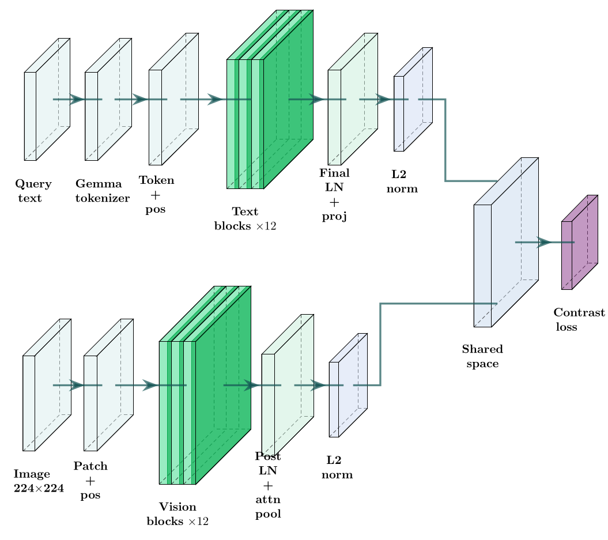
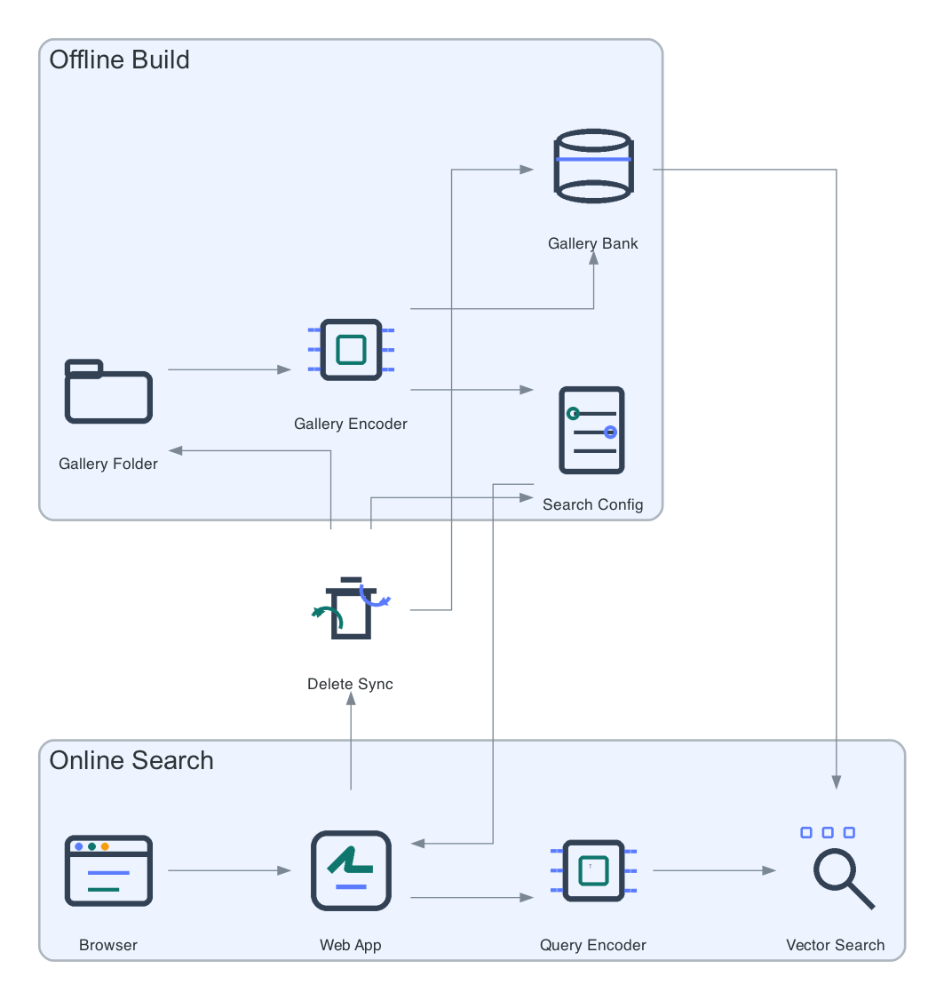

# Architecture

SemanticGallery has one offline path and one online path. The offline path builds a gallery index from local files. The online path serves search results from that index.

## Model

The text tower encodes the query. The vision tower encodes each gallery image. Both outputs are L2-normalized into the same embedding space, so online retrieval is one text forward pass followed by vector search over precomputed gallery embeddings.

- Text input: query text tokenized by the SigLIP2 tokenizer
- Image input: RGB gallery image resized for the SigLIP2 vision tower
- Output: normalized embeddings in a shared vector space
- Why a dual encoder: the gallery can be encoded offline once, which keeps query latency low even for large folders

## Deployment

## Offline Path

1. The gallery encoder scans the target folder and keeps only supported image files.
2. It runs the MLX image encoder over those files and writes the embedding bank, indexed path list, and skipped-image report.
3. It writes a search config that points the web app at the selected gallery, model, index files, and optional metadata manifest.

## Online Path

1. The browser sends a text query to the local web app.
2. The query encoder runs the SigLIP2 text tower in MLX and produces one query vector.
3. The search engine scores that vector against the precomputed gallery embeddings.
4. If a metadata manifest is present, the runtime applies a small text-match boost from the manifest captions before final ranking.
5. The web app resolves the ranked paths into thumbnails, filenames, and time metadata. When EXIF capture time is missing, the UI falls back to file modification time.

## Permanent Delete Path

When the user deletes an image from the web UI, the app removes the file from the gallery, updates the file-backed index, and rewrites the metadata manifest if one is present. The next search sees the same state as the local folder. Delete is permanent.
