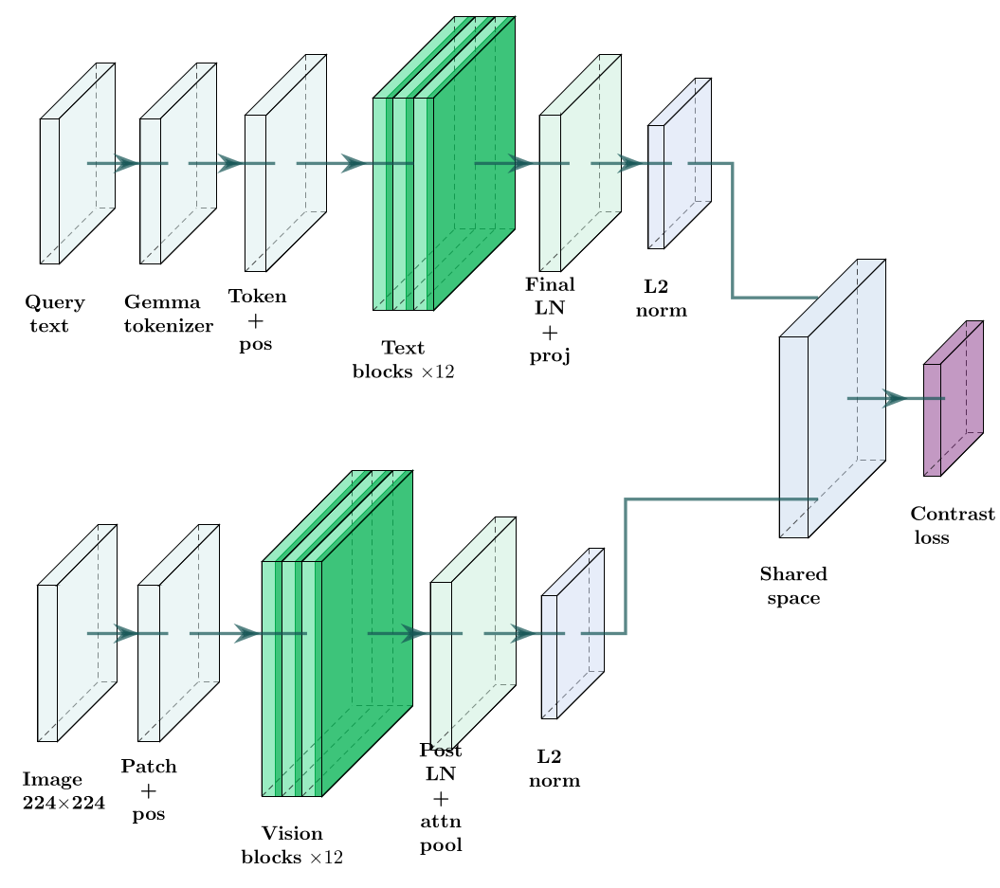
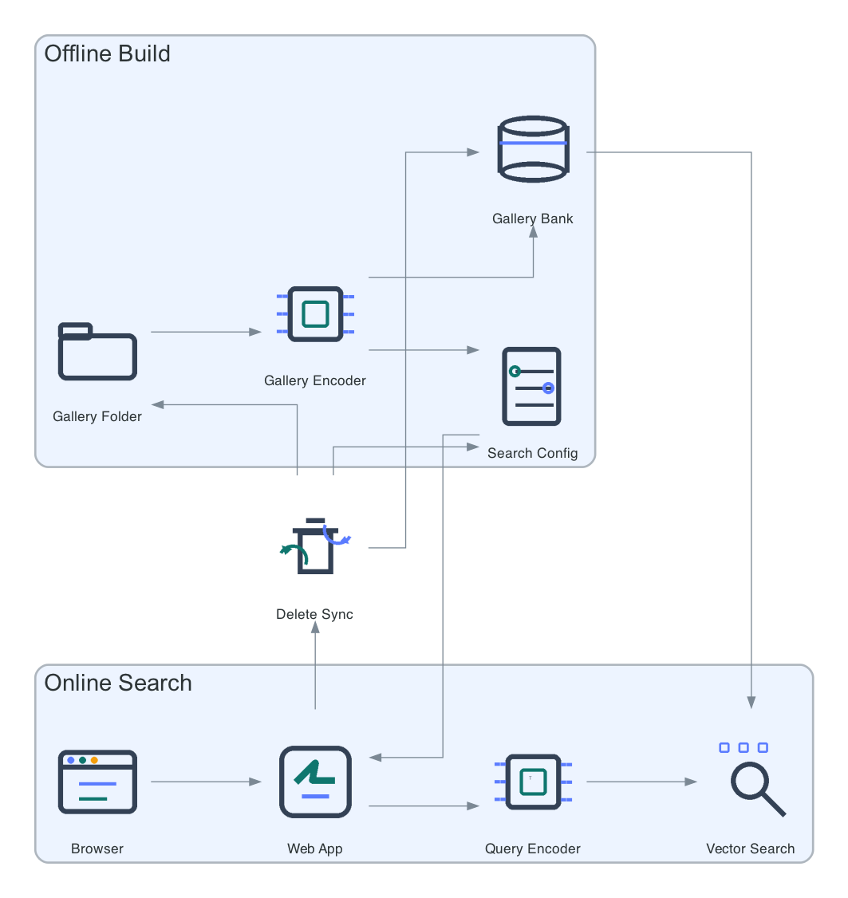

# Architecture

SemanticGallery is a native Swift macOS app with two long-running paths. The offline path prepares a folder for search. The online path serves text and image queries from the workspace.

## Model

The text tower encodes the query. The vision tower encodes each image. Both outputs are L2-normalized into the same embedding space, so search stays fast once the gallery bank has been prepared.

- Text input: query text tokenized by the SigLIP2 tokenizer
- Image input: RGB image resized for the SigLIP2 vision tower
- Output: normalized embeddings in a shared vector space
- Why a dual encoder: the gallery can be encoded offline once, so query latency stays low even for large folders

## App Layout

- `Workspace`: path bar, search field, result limit, thumbnail grid, preview, metadata, selection mode, and delete
- `Settings`: choose the folder, watch indexing status, and start private adaptation
- `Library database`: stores content hashes, file instances, encoder versions, finished adaptation records, and remembered folder bookmarks

## Deployment

The current desktop release is written in Swift and uses MLX directly inside the app. The packaged `dmg` already bundles the base model files, the published stage-1 checkpoint, and the public adaptation anchor.

## Offline Path

1. You choose a folder in `Settings`.
2. The app scans the folder and keeps only supported image files.
3. Each file is hashed. One embedding row is stored per unique content hash, while file-instance rows keep the visible paths.
4. The app writes the results into `library.sqlite` and builds the folder-scoped search view used by the workspace.
5. If private adaptation runs, the app stores the adapted encoder, then refreshes every stored embedding with that encoder.

## Online Path

1. You enter text or paste an image in the workspace.
2. The app encodes that query locally.
3. The search engine scores the query against the embeddings visible to the currently selected folder.
4. The workspace resolves the ranked results into thumbnails, filenames, preview images, and metadata.
5. Similar-image search reuses the selected preview image as the next image query.

## Delete Path

When you delete from the workspace, the app moves only the current file path to Trash. If the same image content exists in another folder, its remaining file-instance rows stay intact and the shared embedding is reused until no visible path references it anymore.
